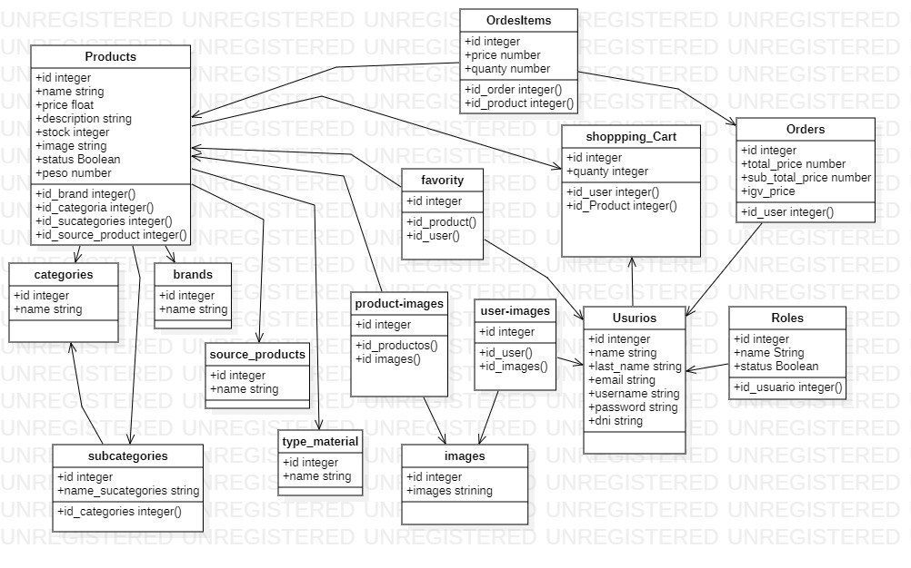

# Ecommerce-Bravaso

```
Alcance de tienda virtual Bravazo:
*ALcances

- Tener busqueda mas concisa de productos, atraves  de un manejo de filtrado por categorias, marcas y precios
- obtener una  mayor informacion  del producto que se va comprar mediante  uso de     imagenes ,textos informativos como descripcion y detalle tecnico
-poder añadir productos a una lista de favoritos para su posible compra
-poder crear usuarios
-tener lista de recomedaciones segun el producto  seleccionado
-tener visualizacion de los productos que se agregan al  carrito de compras
-tener dashboard  que ayude al manejo y control datos ingresados(productos,usuarios, etc...)


*Mejoras al futuro

-A futuro se desea que todo el proceso de compra y envio se realize en nuestra pagina sin tienda fisica.
-Horario de atencion ilimitado(abierto 24 horas).
-implementar un medio de pagos (En modo de produccion)
-tener la opcion de recuperar contraseña
-uso de comentarios y calificacion de producto por estrellas
-manejo de descuentos
-busquedas por filtro mas precisos
-seguimiento de ENVIO de producto
-graficos estadisticos

Modulos
- Productos (Nivel 1º Categoria) (✓)
- Categorias (✓)
- Subcategorias (✓)
- source_products (✓)
- Brands (✓)
- Type_material (✓)
- images (✓)
- product-images (✓)
- user-images (✓)
- favority (✓)
- Usuarios (con permisos) (✓)
- Roles (✓)
- Carrito de compras (✓)


Por implementar:
- Orders (✓)
- OrdersItems (✓)

** Entregas (Opc)

Modalidades de pago
-- Mercadopago
-- Tarjeta Debito o Credito
-- Pagoefectivo - App de Bancos
```

## Diagrama Entidad Relación

Para la creacion de modelos se diseño una digrama de entidad relacion



```
backend :https://github.com/obitodark/backend_bravaso
frondend:https://github.com/obitodark/frond_end_bravaso
vercel :https://frondendbravaso.vercel.app/
swagger :https://frozen-tor-02595.herokuapp.com/swagger-ui

integranteS:

-Willians Ccallo
-Fredy de la Cruz
-Jose Velarde
```
